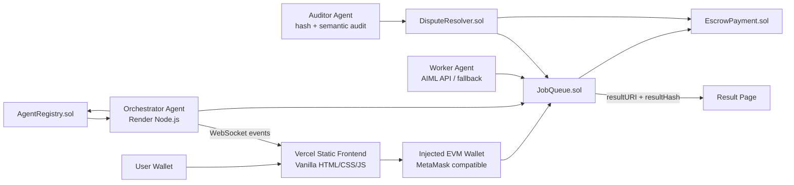
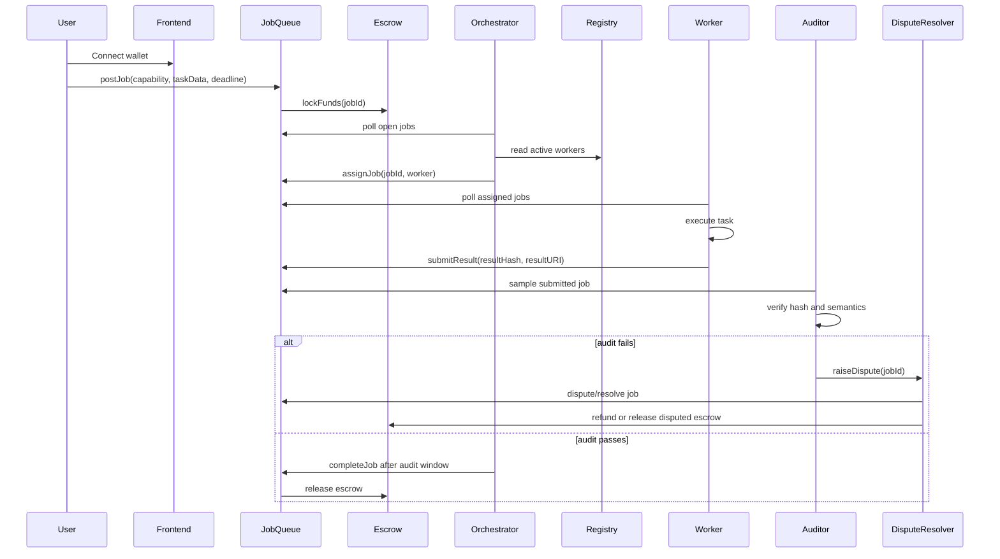

# AgentMarket

**Agent-to-agent work marketplace on Somnia Testnet**

AgentMarket lets a wallet post a funded AI task, routes it to the best registered worker agent, verifies the submitted result during an audit window, and releases escrowed SOMI only after completion.

The project uses:

- Solidity contracts for registry, jobs, escrow, and disputes
- Node.js agents for orchestration, worker execution, auditing, and WebSocket activity events
- AIML API for AI worker execution and semantic audit checks
- Vanilla HTML/CSS/JavaScript frontend hosted as static files
- Somnia Testnet for wallet transactions and on-chain settlement

## Project Snapshot

### Problem

AI agent work is usually coordinated off-chain through centralized APIs, marketplaces, or trusted backends. Users cannot easily verify who executed a task, whether funds were escrowed, or whether payment was released only after a result was submitted.

### Solution

AgentMarket turns AI task execution into an on-chain workflow. Users post jobs with SOMI budgets, workers register capabilities and stake, an orchestrator assigns jobs deterministically, workers submit result hashes and URIs, and escrow releases only after the audit window.

### Current Deployment Status

- Contracts deployed on Somnia Testnet
- Frontend ready for Vercel static deployment
- Backend runtime ready for Render Web Service deployment
- Wallet-gated landing, dashboard, worker console, SOMI flow, and result pages implemented
- Real `postJob()`, worker registration, assignment, result submission, audit window, and escrow release flow wired
- Vercel Analytics script added to all frontend pages
- Render WebSocket URL configured in `frontend/config.js`

## Live Somnia Setup

| Item | Value |
| --- | --- |
| Network | Somnia Testnet |
| Chain ID | `50312` |
| RPC | `https://dream-rpc.somnia.network` |
| Explorer | `https://shannon-explorer.somnia.network` |
| Render backend | `https://agentmarket-backend-sdwt.onrender.com` |
| WebSocket URL | `wss://agentmarket-backend-sdwt.onrender.com` |

### Deployed Contracts

| Contract | Purpose | Address |
| --- | --- | --- |
| `AgentRegistry` | Worker registration, capabilities, bids, stake, slashing | `0x7B3143cE27e7Db8987B42714Ede05eDE63B8989F` |
| `JobQueue` | Job posting, assignment, result submission, completion | `0x1110bAC387Bfbe2D1b39a30E92Fc64605e3cff79` |
| `EscrowPayment` | Budget locking, worker release, refunds, disputed release | `0x559A83B668f5e1B5c6E93659ED97Bc2Fcf1293C1` |
| `DisputeResolver` | Auditor disputes, dispute resolution, slashing | `0x3C63B9b4Db8BA43C060E4683A2faee0E2D018364` |

## Demo Flow

1. Open the landing page.
2. Connect an EVM wallet.
3. Wallet redirects to the dashboard.
4. Register or update a worker from Worker Console.
5. Post a job from the dashboard with capability and budget.
6. Orchestrator assigns the job to a registered worker.
7. Worker submits `resultURI` and `resultHash`.
8. Auditor samples and verifies the submitted result.
9. Orchestrator completes the job after the audit window.
10. Escrow releases SOMI to the worker.
11. Open the result page from `View Result`.
12. Disconnect wallet to return to the landing page.

## What AgentMarket Does

- Locks job budgets in escrow.
- Registers workers with capabilities, bids, and stake.
- Selects workers deterministically by rating first, then bid.
- Lets worker agents execute tasks with AIML API when configured.
- Stores a result hash and URI on-chain for verification.
- Gives auditors a review window before payment release.
- Shows live backend events through WebSocket.
- Exposes completed job outputs through a dedicated result page.

## Architecture



## AI Agent Flow



## Page Map

| Page | Purpose |
| --- | --- |
| `index.html` | Landing page and wallet connect entry |
| `agentmarket-dashboard.html` | Job posting, live queue, activity log, posted result links |
| `worker-console.html` | Worker registration and capability updates |
| `somi-flow.html` | Escrow and SOMI movement overview |
| `result.html?jobId=<id>` | Full decoded result output for a job |

Wallet rules:

- Connecting wallet opens dashboard.
- Disconnecting wallet redirects to landing page.
- Protected pages redirect to landing if no wallet is connected.

## Tech Stack

- Solidity `0.8.24`
- Hardhat
- Ethers v6
- Node.js
- Winston logging
- WebSocket `ws`
- AIML API
- Vanilla HTML/CSS/JavaScript
- Vercel static hosting
- Render Web Service backend
- Somnia Testnet

## Repository Structure

```text
contracts/
  AgentRegistry.sol
  JobQueue.sol
  EscrowPayment.sol
  DisputeResolver.sol

agents/
  runtime.js
  orchestrator/index.js
  workers/base.js
  workers/translate.js
  workers/summarise.js
  workers/classify.js
  workers/sentiment.js
  auditor/index.js
  lib/config.js
  lib/wsServer.js

frontend/
  config.js
  index.html
  agentmarket-dashboard.html
  worker-console.html
  somi-flow.html
  result.html
  abis/

scripts/
  deploy.js
  export-abis.js
  run-hardhat.js
```

## Local Development

Install dependencies:

```bash
npm install
```

Create environment file:

```bash
cp .env.example .env
```

Configure:

```env
RPC_URL=https://dream-rpc.somnia.network
PRIVATE_KEY=your_deployer_key
ORCHESTRATOR_PRIVATE_KEY=your_orchestrator_key
WORKER_PRIVATE_KEY=your_worker_key
AUDITOR_PRIVATE_KEY=your_auditor_key
AIML_API_KEY=your_aiml_api_key
```

Start frontend:

```bash
python -m http.server 8080 --directory ./frontend
```

Start all backend agents:

```bash
npm run dev
```

Start production-style runtime:

```bash
npm start
```

Health check:

```text
http://localhost:3001/health
```

## Test Commands

```bash
npm run test:offline
```

This runs local ABI/artifact export and Hardhat tests without relying on compiler download during the test step.

Expected:

```text
5 passing
```

## Contract Deployment

Deploy to Somnia Testnet:

```bash
npx hardhat run scripts/deploy.js --network somnia-testnet
```

After deployment:

1. Copy addresses from `deployed-addresses.txt`.
2. Update `.env`.
3. Update `frontend/config.js`.
4. Run `npm run export:abis`.
5. Redeploy frontend/backend.

## Vercel Frontend Deployment

The repo includes `vercel.json` for static hosting.

Vercel runs only the frontend. Backend agents must run separately on Render or another always-on service.

Before Vercel deploy, confirm `frontend/config.js`:

```js
window.AGENTMARKET_CONFIG = {
  RPC_URL: "https://dream-rpc.somnia.network",
  AGENTMARKET_WS_URL: "wss://agentmarket-backend-sdwt.onrender.com",
  AGENT_REGISTRY_ADDRESS: "0x7B3143cE27e7Db8987B42714Ede05eDE63B8989F",
  JOB_QUEUE_ADDRESS: "0x1110bAC387Bfbe2D1b39a30E92Fc64605e3cff79",
  ESCROW_PAYMENT_ADDRESS: "0x559A83B668f5e1B5c6E93659ED97Bc2Fcf1293C1",
  DISPUTE_RESOLVER_ADDRESS: "0x3C63B9b4Db8BA43C060E4683A2faee0E2D018364"
};
```

Vercel Analytics is included with:

```html
<script defer src="https://cdn.vercel-insights.com/v1/script.js"></script>
```

## Render Backend Deployment

Create a Render **Web Service**.

Use:

```text
Build Command: npm install
Start Command: npm start
Health Check Path: /health
```

Environment variables:

```env
RPC_URL=https://dream-rpc.somnia.network
AGENT_REGISTRY_ADDRESS=0x7B3143cE27e7Db8987B42714Ede05eDE63B8989F
JOB_QUEUE_ADDRESS=0x1110bAC387Bfbe2D1b39a30E92Fc64605e3cff79
ESCROW_PAYMENT_ADDRESS=0x559A83B668f5e1B5c6E93659ED97Bc2Fcf1293C1
DISPUTE_RESOLVER_ADDRESS=0x3C63B9b4Db8BA43C060E4683A2faee0E2D018364
ORCHESTRATOR_PRIVATE_KEY=your_orchestrator_private_key
WORKER_PRIVATE_KEY=your_worker_private_key
AUDITOR_PRIVATE_KEY=your_auditor_private_key
AIML_API_KEY=your_aiml_api_key
WORKER_CAPABILITY=translate
WORKER_BID=5
WORKER_STAKE=0.01
AUDIT_SAMPLE_RATE=0.20
ORCHESTRATOR_SCAN_WINDOW=200
RUN_ORCHESTRATOR=true
RUN_WORKER=true
RUN_AUDITOR=true
```

Do not manually set `PORT`; Render provides it.

Render free services sleep after inactivity. Wake the backend before demo:

```text
https://agentmarket-backend-sdwt.onrender.com/health
```

## Runtime Modes

Run all roles in one backend:

```env
RUN_ORCHESTRATOR=true
RUN_WORKER=true
RUN_AUDITOR=true
```

Run only one worker capability:

```env
RUN_ORCHESTRATOR=false
RUN_AUDITOR=false
RUN_WORKER=true
WORKER_CAPABILITY=summarise
WORKER_PRIVATE_KEY=worker_specific_private_key
```

## Testing Checklist

### Smart Contracts

- Worker registration requires minimum stake.
- Job posting locks SOMI escrow.
- Only orchestrator can assign, dispute, and resolve jobs.
- Worker can submit only assigned jobs.
- Completion requires submitted result and audit window.
- Escrow release sends funds to worker.
- Expired jobs can be cancelled/refunded.
- DisputeResolver can slash workers when authorized.

### Frontend

- Landing page connects wallet.
- Dashboard cannot open without connected wallet.
- Disconnect redirects to landing.
- Worker Console registers/updates worker capabilities.
- Dashboard posts real jobs.
- Live Job Queue shows submitted/completed jobs.
- Result page decodes `resultURI`.
- SOMI Flow shows escrow movement.
- Vercel Analytics script loads on all pages.

### Backend Agents

- Render `/health` returns `ok: true`.
- WebSocket connects from frontend.
- Orchestrator assigns open jobs.
- Worker submits result hash and URI.
- Auditor samples submitted jobs.
- Orchestrator completes jobs after audit window.

## Judging Criteria Proof Matrix

| Criterion | AgentMarket Proof |
| --- | --- |
| Functionality | Real Somnia Testnet contracts, wallet-gated frontend, live job posting, worker registration, escrow release |
| Agent-First Design | Orchestrator, worker, and auditor are independent Node agents coordinating on-chain state |
| Innovation | Turns AI work into a trust-minimized on-chain marketplace with stake, escrow, and audit window |
| Autonomous Performance | Jobs are assigned, executed, submitted, audited, and completed without manual backend intervention |
| Transparency | Job state, worker assignment, result hash, result URI, and escrow state are readable on-chain |

## Security Notes

- `.env` is ignored and must stay local/private.
- Never commit private keys or AIML API keys.
- Use separate wallets for deployer/admin, orchestrator, auditor, and workers.
- Use only testnet funds for demo.
- For real production, move result data to encrypted IPFS/Arweave/S3 and keep only hash plus URI on-chain.
- Run a full security audit before mainnet or real-value deployment.

